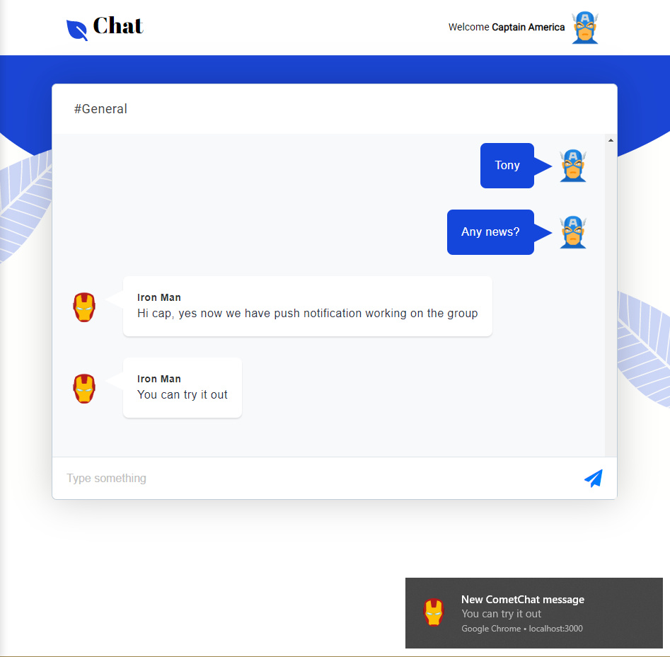
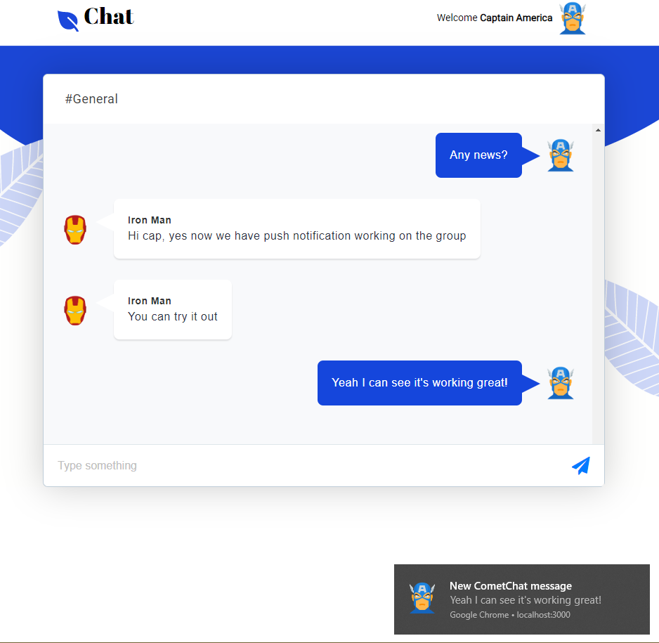

# Build a React chat app with push notifications

This sample app shows how to build a React chat application using CometChat Pro that will send push notifications. 



TODO: Add macOS screenshot

Jump straight into the code or read the accompanying step-by-step guide [here on our blog]().

## Technology

This demo uses:

* React
* CometChat Pro JavaScript SDK
* Firebase Cloud Messaging

## Running the demo locally

Running the demo locally isn't tricky but please do make care to follow the instructions carefully. 

### Download and setup the repository

* Download the repository [here](https://github.com/cometchat-pro-tutorials/react-chat-push-notifications/archive/master.zip) or run `git clone https://github.com/cometchat-pro-tutorials/react-chat-push-notifications.git`
* In the `react-chat-push-notifications` directory, run `npm install`

### Configure CometChat
* Head to the [CometChat dsahboard](https://app.cometchat.com) (you'll need to create an account)
* Create a new app
* Head to the **Keys** tab and note your app ID and auto-generated full access key
* Create a `.env` file in the root folder of the project and paste the following content in it:

```
REACT_APP_COMETCHAT_API_KEY=YOUR_API_KEY
REACT_APP_COMETCHAT_APP_ID=YOUR_APP_ID
REACT_APP_COMETCHAT_GUID=supergroup
```

Replace `YOUR_API_KEY` and `YOUR_APP_ID`with your API KEY, APP ID as obtained from your CometChat dashboard.

### Configure Firebase


* Register a [Firebase dashboard](https://console.firebase.google.com) (you'll need to create an account)
* Create a new Firebase app
* Add a new web application into your Firebase project
* Click on the settings menu, then go to the General tab 
* Copy the Firebase config variable into `src/firebase.js` and `public/firebase-messaging-sw.js` (look at the comments there)
* Then in Firebase settings, go to the Cloud Messaging tab. Copy the server key here
* Go back into CometChat PRO dashboard, into Push Notification extension and click on `Actions -> Settings` Paste the FCM server key here
* run `npm start`

## Useful links

* [📚Tutorial](https://prodocs.cometchat.com/docs)

## Other examples

* [ReactJS Chat app](https://github.com/cometchat-pro/javascript-reactjs-chat-app)
